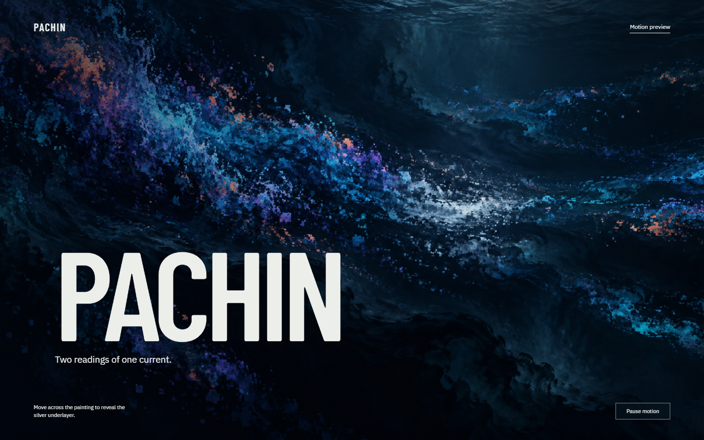

# Chromatic Overlay — Motion Preview

An interactive two-layer painting study for the PACHIN website. One current has two visual readings: a saturated, pixel-edged surface and a quieter silver-blue painting underneath. Move across the scene to uncover the second layer; the reveal follows the pointer, then returns to its own slow drift.

[**Open the live preview**](https://pachin1919.github.io/chromatic-overlay-motion-preview/)



This is a standalone art-direction demo, not the production website. It has no account, backend, tracking, or external asset requests. The page is English-only. It supports pause and the system's reduced-motion preference; on touch screens, drag across the painting to explore the reveal.

To run locally, serve this directory with any static server and open `index.html`. For example, in PowerShell:

```powershell
py -m http.server 4332 --bind 127.0.0.1
```

The two paintings are project-specific visual assets and are not offered for reuse. Barlow Condensed and IBM Plex Sans license texts are included in `assets/`; GSAP's license notice is included in `vendor/gsap.min.js`.
